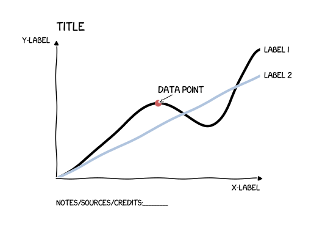
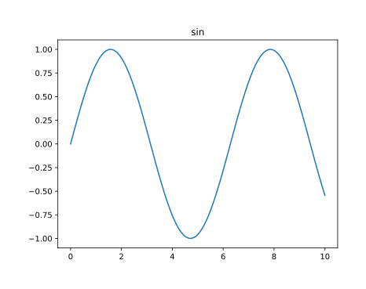
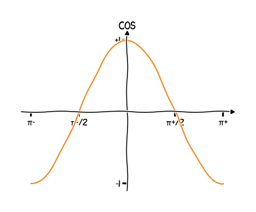

[](https://github.com/Kislovskiy/talks/actions/workflows/2023-pycon-de-python-pdf-workflow.yml)
# The bumps in the road: A retrospective on my data visualisation mistakes

## TL;DR
* 🚀 Apply software engineering best practices can greatly enhance productivity in data visualization projects
* 🤝 Working collaboratively with partners can help generate value quickly
* 🔬 Aim for reproducibility to ensure accuracy and consistency in the visualization results
* 💾 Backup the data to prevent loss of important information
* 🗂️ Versioning the code enables better tracking of changes and makes it easier to revert to previous versions if necessary
* 🕵️‍♀️ Setting up monitoring ensures that any errors or issues are detected and resolved quickly
* 🚚 Establishing a continuous delivery pipeline can provide efficient and timely delivery of data visualizations to customers

To start:
```
conda env create -f environment.yml
```

## Galery

## General stracture of the project

```
drwxr-xr-x     - kislovskiy  5 Apr 22:09  2023_PyData_Berlin
drwxr-xr-x     - kislovskiy  6 Apr 12:37  ├── data
.rw-r--r--  9.9k kislovskiy  6 Apr 12:37  │  ├── data.csv
.rw-r--r--    39 kislovskiy 31 Mar 08:07  │  └── test_data.csv
.rw-r--r--   102 kislovskiy  6 Apr 17:26  ├── environment.yml
.rw-r--r--  1.2k kislovskiy  4 Apr 21:33  ├── README.md
.rw-r--r--  103k kislovskiy  6 Apr 16:17  ├── reproducibility.ipynb
drwxr-xr-x     - kislovskiy  6 Apr 12:36  ├── results
.rw-r--r--  244k kislovskiy  6 Apr 17:39  │  ├── cos.svg
.rw-r--r--   13k kislovskiy  6 Apr 17:10  │  ├── dynamic.pdf
.rw-r--r--  112k kislovskiy  5 Apr 22:26  │  ├── galery.pdf
.rw-r--r--  217k kislovskiy  6 Apr 17:41  │  ├── sin.svg
.rw-r--r--  9.3k kislovskiy  6 Apr 17:10  │  └── static.pdf
drwxr-xr-x     - kislovskiy  6 Apr 17:20  ├── src
.rw-r--r--  1.0k kislovskiy  2 Apr 16:27  │  ├── assemble_plots.py
.rw-r--r--   11k kislovskiy  6 Apr 13:59  │  ├── less-is-more.py
.rw-r--r--  1.1k kislovskiy  6 Apr 17:39  │  ├── plot_cos.py
.rw-r--r--   343 kislovskiy  6 Apr 17:18  │  ├── plot_data.py
.rw-r--r--    29 kislovskiy 31 Mar 10:19  │  ├── plot_nothing.py
.rw-r--r--  1.1k kislovskiy  6 Apr 17:41  │  ├── plot_sin.py
.rw-r--r--  1.8k kislovskiy  6 Apr 17:10  │  ├── plot_text.py
drwxr-xr-x     - kislovskiy  5 Apr 20:14  │  ├── suboptimal_code
.rw-r--r--  282k kislovskiy  6 Apr 17:20  │  │  └── sin.ipynb
.rw-r--r--   286 kislovskiy  6 Apr 13:59  │  └── transform_data.py
drwxr-xr-x     - kislovskiy  6 Apr 17:26  └── tests
.rw-r--r--   213 kislovskiy  6 Apr 17:33     ├── test_data.py
.rw-r--r--     0 kislovskiy  5 Apr 22:41     ├── test_plot_cos.py
.rw-r--r--   755 kislovskiy  6 Apr 17:26     └── test_transform_data.py
```

### Common chart components


### Sine


### Cosine

