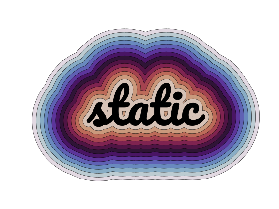
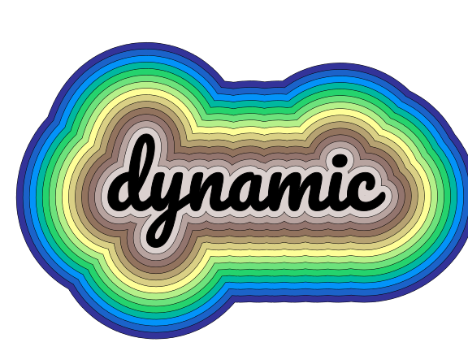
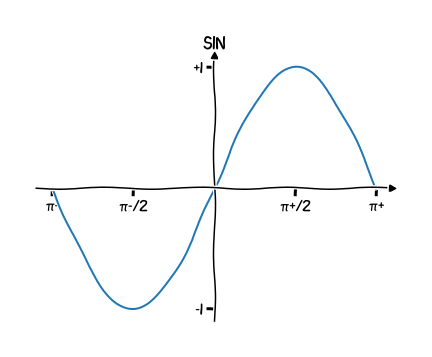

[](https://github.com/Kislovskiy/talks/actions/workflows/2023-pycon-de-python-pdf-workflow.yml)
# The bumps in the road: A retrospective on my data visualisation mistakes

## TL;DR
* 🚀 Apply software engineering best practices can greatly enhance productivity in data visualization projects
* 🤝 Working collaboratively with partners can help generate value quickly
* 🔬 Aim for reproducibility to ensure accuracy and consistency in the visualization results
* 💾 Backup the data to prevent loss of important information
* 🗂️ Versioning the code enables better tracking of changes and makes it easier to revert to previous versions if necessary
* 🕵️‍♀️ Setting up monitoring ensures that any errors or issues are detected and resolved quickly
* 🚚 Establishing a continuous delivery pipeline can provide efficient and timely delivery of data visualizations to customers

To start:
```
conda env create -f environment.yml
```

## General stracture of the project

```
.
├── .github
│  └── workflows
│     └── 2023-pycon-de-python-pdf-workflow.yml
├── 2023_PyData_Berlin
│  ├── data
│  ├── environment.yml
│  ├── README.md
│  ├── results
│  ├── src
│  │  ├── assemble_plots.py
│  │  ├── less-is-more.py
│  │  ├── plot_common_chart.py
│  │  ├── plot_cos.py
│  │  ├── plot_data.py
│  │  ├── plot_nothing.py
│  │  ├── plot_sin.py
│  │  ├── plot_text.py
│  │  ├── plotting_utils.py
│  │  ├── suboptimal_code
│  │  │  ├── chart.ipynb
│  │  │  ├── missleading.ipynb
│  │  │  └── sin.ipynb
│  │  └── transform_data.py
│  └── tests
│     ├── test_data.py
│     ├── test_plot_cos.py
│     └── test_transform_data.py
└── LICENSE
```

# Galery of plots

### Plot text



### Common chart components


### Same data different colormaps


### Don't trust the defaults


### Sine


### Cosine


# Transcript

**The bumps in the road: A retrospective on my data visualisation mistakes**

## Slide 1 - 2
Hi, I am Artem Kislovskiy a software engineer at day and pysicist at night.
Past 8 years I've been working on data visualisation projects in different domains, starting from Computational Fluid Dynamics, to Buisness Analytics.
When I first started a datavisualisation project I was very excited, and thought that it would be a piece of cake.
As you may deduce from the title of my talk, it was not the case.
The bumps in the road were many, and the journey was turbulent.

## Slide 3
When I look back at my journey, I see that I didn't know the rules for better data visualisations.
I spent too much time on the wrong things, and I didn't have a clear vision of what I was trying to achieve.
I was completelly lost in how to use version control for my plotting code, which ended up in a mess of notebooks and scripts.
I was sure that visualisations are unbreakable, and I didn't have a backup plan.
I made a mistake of not setting up monitoring, and I didn't discovered the problem until it was too late.
But I've learned a lot, and I want to share my experience with you.

## Slide 4
I am very easy to inspire, and when someone talks about data exploration it's hard for me to resist.
I want to start coding right away.
I draw coloreful images in my head, and I want to see them on the screen.
I can spend hours on prettifying the plot and making it look nice.
However, I've learned that it's not the best way to start a data visualisation project.
Often, people have completelly different expectations of what the visualisation should look like.
Maybe they even don't need a visualisation at all.
In some cases they need an interactive dashboard, in other cases they need a report, and in some cases they need to learn something from the data.
I love matplotlib, most of the graphs I've made for this presentation were made with it, but it's not the best tool for every job.
But I'll stick to matplotlib for this presentation, because it's the most popular tool for data visualisation.
It also teaches to apply object oriented approach to data visualisation.

Static visualisations are usually created for reports, and they are awesome for communicating results.
Dynamic visualisations usually created for interactive dashboards, and they are very helpful in exploratory data analysis.

But remember before coding anything, you need to have a clear vision of what you are trying to achieve.
That's why the first graph I make is always the one drawn on a piece of paper.
Think how you need to display the data to answer the question.
If you were to compare two different configurations of the application deployed for A/B testing, you would probably want to see the difference between the two over time.
And line chart is a good choice for that.
Or in a different case, you may want to compare different data processing algorithms, and you'll use a bar chart for this.
Also consider the extreme cases, for example when time of the first algorithm is significantly greater than the time of the second algorithm.
Experiment on paper, and then you can start coding.

And again, The best visualisation software or library is the one that allows you to make the figures you need.

## Slide 5
Enough hypothetical examples, let's get to the code!
I assume that everyone in the room knows what is a version contorol and knows git.
If you don't, I recommend you to invest time in learning it.
Together with continious integration principles it can automate you out of routine tasks, and it will make your life easier.

For data visualisation projects I start simple, but you could notice a few things.
First is a directory with all the code for the project.
Second is a .github folder, that contains a file with a workflow for generating a galery.pdf file.
The workflow is triggered when I push a commit.
It generates a galery.pdf file with all the plots from the repository.
It's very handy to have a gallery.pdf as a reference of plots you have, but you can also see how the plots change over time, and easily revert some of them to previous versions if necessary.
For the same reason I like to include .svg files in the README.md file, however the README could become bulky if you have a lot of plots, that's why I prefer to have a separate file with all the plots, and in README only the most important ones.


## Slide 6

In my projects I find myself using mostly line charts (scatter plots), bar charts, and tables.
If you remember from the list of my mistakes, I didn't know the rules for better data visualisations.
They exist, I first learned them from Nicolas P. Rougier's book "Scientific Visualization: Python + Matplotlib", which I highly recommend.
* Rule 1: Know Your Audience
* Rule 2: Identify Your Message
* Rule 3: Adapt the Figure to the Support Medium
* Rule 4: Captions Are Not Optional
* Rule 5: Do Not Trust the Defaults
* Rule 6: Use Color Effectively
* Rule 7: Do Not Mislead the Reader
* Rule 8: Avoid "Chartjunk"
* Rule 9: Message Trumps Beauty
* Rule 10: Get the Right Tool
They are worth a separate talk, but we'll see them in action in the next slides.

## Slide 7

Consider the basic line chart.
Remember everything in Python is an object, and matplotlib is no exception.
Your coding journey always starts with creating a figure and axes objects.

There are a couple of things that are different form the default matplotib settings.
First you may notice that title is left aligned.
The job of the title is to accurately convey to the reader what the figure is about, what point it makes.
The y-axis label is rotated by 90 degrees, which is easier to read.
The lines are labeled directly on the plot which reduces the coginitive load.

TODO: show bad and good line charts I can use Bitcoin price chart as an example

TODO: add example of good looking table

When you're trying to show too much data at once, you may end up not showing anythinhg.

## Slide 10

Another argument for using data visualisation is to verify and validate numbers.
Buisiness people for who we usually create visualisation are busy and don't have enought time to decipher a cryptic figures.
What they want is to get a clear demonstation that something worthwhile and interesing was acomplished, they want to see KPI's.
It's very tempting to use an average value as some sort of KPI, but it's not always the right choice.
I recently found this amazing article that shows how completelly different datasets could have the same statistics.
Spend some time verifing your data pipelines.

## Slide 11

Now let's get back to structure of the data visualisation project.
The repository contains the src, tests, data, and results directories.
I prefer to use conda for managing my environments, and I use the environment.yml file to specify the dependencies.

The src directory contains the python scripts for generating the plots.
It also contains the assemble_plots.py script that assembles all the plots into a single pdf file.
This script is called by the workflow that generates the gallery.pdf file.
Having gallery.pdf file is very handy in big projects, because it allows you to see all the plots in one place.
It also works as a test, because if you change something in the code, and the gallery.pdf file changes, you know that something is wrong if the workflow fails.

## Slide 12-14

gallery.pdf is a better alternative to endless Jupyter notebooks.
I like Jupyter notebooks.
I thought that they are the best way to share results.
It was the case until I spend half a day trying to find a specific plot in a directory with a huge number of notebooks with similar names where each notebook had lot's of cells.
It was a nightmare.
I also tend to copy and paste code from one notebook to another and from one cell to another cell, and I end up with a lot of duplicate code.
The horror was when I had to change something in the code, and I had to do it in 10 different notebooks.
At that point I thought that it's easier and faster to run a marathon than to change something in my code.
It blocked creativity and productivity.
This experience has taught me to stay away from Jupyter, however I still use it a lot for prototyping and for quick experiments.

The better approach is to separate data processing and data visualisation.
And use object oriented approach to data visualisation.

Let me explain what I mean by looking first into bad example.
Here are two Jupyter notebook cells where data is coupled with visualisation.
If I copy and paste the cell and change the data, the beautiful visualisation code will not work, I need to tune it.
Imagine if I need to experiment with colors and line styles, I would copy and paste this code N times to different cells.
The alternative to this is to extract functions.
The visualisation function is now decoupled from the data, and it can be reused.
It takes data and axis as arguments, and it returns the axis with the plot.
And If I would experiment with colors and style, I would itterate over the parameters and plot the data side by side.

## Slide 15

Tests are vitally important for data visualisation projects.
They may seem redundant, but they could save you a lot of time in a long run.
You know how your data looks like.
You could test that your processing will fail if datatypes are wrong, or if the data is missing.
You could test that your figure is not empty and contain N number of lines.

Add action: Bad example and Good example.


## Slide 16

When we decopule data processing and visualisation, it's easy to use a source control, like git.

## Slide 17

Remember I said that I made a mistake of not setting up monitoring, and I didn't discovered the problem until it was too late.
Welcome another mistake: not setting up monitoring.
I was in a situation when my processing pipeline was failing for some reason, and the dataset was incomplete.
Since it was one of many pipelines and I didn't have monitoring, I didn't notice it for a while.
It took me a week to reprocess the data, when I could have noticed the problem way earlier.
You could consider sending yourself a notification when something finished successfully, or check daily that the datasets your visualisations are based on are up to date and healthy.

And as we discussed earlier you could use GitHub actions to verify the data visualisation code.
The pipeline should fail if something is wrong with the code, or tests are failing.

## Slide 18

Here is an example of assemble_plots.py script.

TODO add a description

## Slide 19 (I think I need to remove it)
Sometimes we work with visual dasboards in Tableau or Grafana.
Coming back to my very first story about knowing your audience, you could consider creating a duplicate of your production dashboard and call it staging dashboard.
I find it very practical to introdice changes first in staging dashboard, discuss them with the stakeholders, and then push them to production dashboard.

## Slide 20
Stress test your code to know the limits.
Once I found myself writing a script that was working correctly, but it was rediculously slow.
I thought that it's fine. I'll just run it once a day.
But only after I tried to execute it on real size data, I realised that it was not only taking 10 hours to finish, but also caused out of memory exceptions.
I had to rewrite the code to make it more efficient and learn about map-reduce paradigm. But this is another story.

## Slide 21
Now let's recap what we've learned today.

